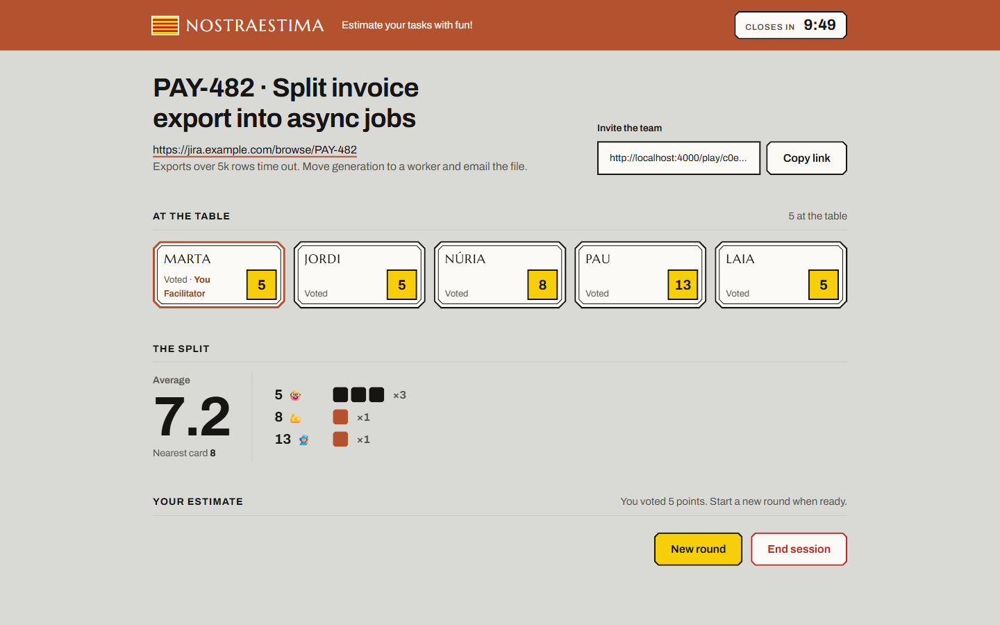
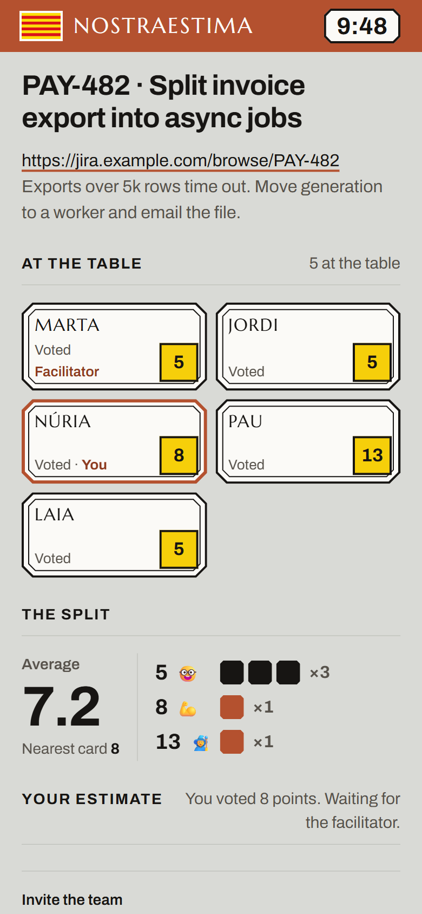

# 🃏 PokerEstima





> Estimate your tasks with fun! A real-time planning poker application for agile teams. One link, no sign-up, and the room closes itself when you're done.


---

## ✨ Features

- 🎴 **One tap to vote** - Tap a card and your vote is sent; tap another to change it before the reveal
- ⚡ **Real-time updates** - Powered by WebSockets for instant synchronization
- 👥 **Team collaboration** - Up to 10 participants per room
- 🔒 **Hidden votes** - Votes stay hidden until the facilitator reveals them (no anchoring bias!)
- 📊 **Instant results** - Average, nearest card and the vote split, one block per vote
- 🔄 **Multiple rounds** - Start a new round without leaving the room
- 📋 **Shareable links** - One-click copy to invite the team
- ⏱️ **Ephemeral rooms** - Rooms close after 10 minutes; the facilitator can add 5 minutes once
- ⌨️ **Keyboard shortcuts** - Type a card's number to vote; the facilitator reveals with <kbd>Shift</kbd>+<kbd>R</kbd>
- 📱 **Built for the side of a call** - Works in a narrow window next to your video meeting

---

## 🚀 Quick Start

### Prerequisites

- Node.js 22.5 or higher (the app uses the built-in `node:sqlite` module)
- npm

### Installation

```bash
# Clone the repository
git clone https://github.com/joaoGabriel55/PokerEstima.git
cd PokerEstima

# Install dependencies
npm install

# Start the server
npm start
```

### Development Mode

```bash
# Start with auto-reload on file changes
npm run dev
```

The app will be running at **http://localhost:4000** 🎉

---

## 🎮 How to Play

### 1. Open a Room 🏠

1. Go to `/play` or `/`
2. Enter your name and the task (title, plus any links or context)
3. Click **"Start the room"**. You're the facilitator.

### 2. Invite Your Team 📨

1. Click **"Copy link"** and paste it in the call chat
2. Teammates enter their name and take a seat. No account needed.

### 3. Vote 🗳️

1. Tap a card (0, 1, 2, 3, 5, 8, 13, 20, 40, or 100), or type its number
2. Your vote is sent right away; tap another card to change it
3. Plaques show who has voted (yellow) and who is still choosing (dashed), never the value

### 4. Reveal & Discuss 🎉

1. The facilitator clicks **"Reveal votes"** (it shows how many have voted, e.g. 4/5)
2. Every vote appears, with the average, the nearest card and the split
3. Discuss the outliers and agree on an estimate

### 5. New Round 🔄

1. The facilitator clicks **"New round"** to clear the votes
2. Estimate the next task!

---

## 🃏 Point Values

| Points | Emoji | Meaning |
|--------|-------|---------|
| 0 | 😴 | No effort needed |
| 1 | 🔥 | Tiny task |
| 2 | 🚀 | Small task |
| 3 | 🦄 | Small to medium |
| 5 | 🤓 | Medium effort |
| 8 | 💪 | Large task |
| 13 | 🧙 | Extra large |
| 20 | 🐙 | Huge task |
| 40 | 👹 | Massive effort |
| 100 | 💀 | Epic! (Maybe split it?) |

---

## ⌨️ Keyboard Shortcuts

| Keys | Who | Action |
|------|-----|--------|
| A card's number (e.g. `8`, `1` `3`) | Everyone | Vote for that card |
| <kbd>Shift</kbd>+<kbd>R</kbd> | Facilitator | Reveal votes |
| <kbd>Shift</kbd>+<kbd>N</kbd> | Facilitator | Start a new round |

Shortcuts are ignored while you're typing in a field.

---

## 🛠️ Tech Stack

- **Backend**: Express.js 5.x, server-rendered EJS
- **Real-time**: Socket.io 4.x
- **Frontend**: Vanilla JavaScript, no bundler
- **Storage**: SQLite (`node:sqlite`), persisted on a Fly.io volume in production

---

## 📁 Project Structure

```
PokerEstima/
├── server.js                  # Express + Socket.io server, room cleanup
├── db/index.js                # SQLite connection and schema
├── src/
│   ├── constants.js           # Capacity, room lifetime, deck values
│   ├── helpers.js             # Room expiry, average, safe link formatting
│   ├── controllers/           # HTTP routes and socket events
│   ├── repositories/          # Rooms and members
│   └── views/                 # EJS layout and pages
├── public/
│   ├── script.js              # Client-side logic
│   ├── styles.css             # The PokerEstima visual system
│   └── fonts/                 # Self-hosted Marcellus and Archivo
├── DESIGN.md                  # Design system
├── PRODUCT.md                 # Product context
└── package.json
```

---

## 🔧 Configuration

Environment variables:

| Variable | Default | Description |
|----------|---------|-------------|
| `PORT` | 4000 | Server port |
| `DATABASE_PATH` | `./data/app.db` | SQLite database file |
| `SECRET_KEY` | (dev default) | Session secret; also turns on secure cookies |
| `CORS_ORIGIN` | any origin | Allowed origin for Socket.IO connections; set it in production |

Room rules live in `src/constants.js`: capacity (10), lifetime (10 minutes), the one-time extension (5 minutes) and the disconnect grace period (30 seconds).

---

## 🎯 Room Rules

- **Max 10 people** per room
- **10-minute lifetime** - rooms close by themselves
- **One extension** - in the last 2 minutes the facilitator can add 5 minutes, once
- **Facilitator powers** - only the room creator can:
  - Reveal votes
  - Start new rounds
  - Add time
  - End the session
- **No anchoring** - votes are hidden until revealed, and can't be changed afterwards

---

## 🤝 Contributing

Contributions are welcome! Feel free to:

1. Fork the repository
2. Create a feature branch (`git checkout -b feature/amazing-feature`)
3. Commit your changes (`git commit -m 'Add amazing feature'`)
4. Push to the branch (`git push origin feature/amazing-feature`)
5. Open a Pull Request

---

## 📝 License

ISC License - feel free to use this project however you'd like!

---

## 💡 Tips for Great Estimates

1. **Don't overthink it** - Go with your gut feeling
2. **Estimate complexity, not time** - Story points measure effort
3. **Discuss outliers** - Big differences reveal knowledge gaps
4. **It's not a competition** - There are no wrong answers
5. **Have fun!** - That's why we use emojis 🎉

---

<p align="center">
  Made with ❤️ for agile teams everywhere
</p>

<p align="center">
  <sub>Now go estimate some stories! 🚀</sub>
</p>
